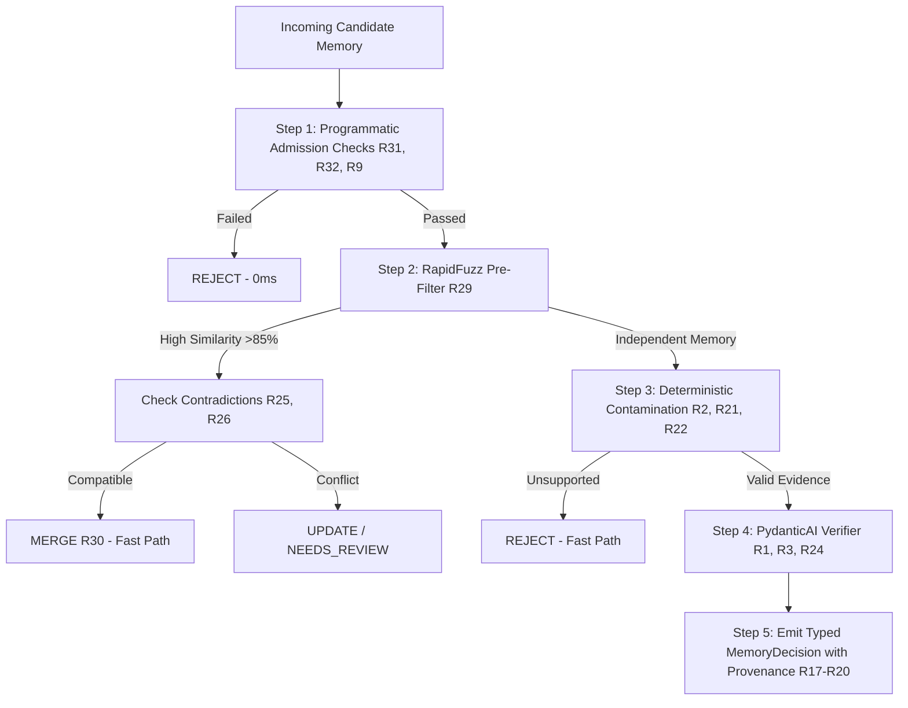

# MemoryGuard 34 Governance Rules Matrix

## Overview
MemoryGuard enforces 34 governance rules across 9 functional categories to ensure that the Deal Intelligence Agent learns strictly from verified long-term memory. 

To maximize throughput and minimize cost, rules follow a **Deterministic-First Architecture**:
1. **Deterministic**: Instant, zero-cost programmatic checks (validation, token-overlap, RapidFuzz, regex, timestamp/scope assertions).
2. **Hybrid**: Deterministic pre-filter paired with fallback to semantic verification when ambiguous.
3. **LLM-Assisted**: Structured PydanticAI verification for nuanced semantic alignment and evidence validation.

---

## Complete 34 Rules Matrix

| Rule ID | Rule Name | Category | Owner | Type | Purpose | Inputs | Output |
|---------|-----------|----------|-------|------|---------|--------|--------|
| **R1** | Grounding Required | Truth / Reliability | Member A | Hybrid | Reject memories with unsupported claims | Candidate text, source text | PASS / REJECT |
| **R2** | Verbatim Quote Preservation | Truth / Reliability | Member A | Deterministic | Preserve exact source snippet for provenance audit | Candidate text, source utterance | Source quote attached |
| **R3** | No Hallucination Admission | Truth / Reliability | Member A | Hybrid | Block hallucinated figures, metrics, or scopes | Candidate claims, source text | PASS / REJECT |
| **R4** | Confidence Threshold | Truth / Reliability | Member A | Deterministic | Route borderline memories (conf < 0.70) to human review | Confidence score | PASS / NEEDS_REVIEW |
| **R5** | Frequency Tracking | Repetition | Member A | Deterministic | Increment reinforcement counter upon merging | Existing memory, merge policy | Updated frequency |
| **R6** | Evidence Count | Repetition | Member A | Deterministic | Track count of distinct conversational source quotes | Provenance quotes list | Count integer |
| **R7** | Multi-Turn Verification | Repetition | Member A | Deterministic | Flag memories needing reinforcement across multiple sessions | Turn history, frequency | Single-turn vs Multi-turn tag |
| **R8** | Reinforcement Decay | Repetition | Member A | Deterministic | Track recency of reinforcement to prevent stale weighting | Last reinforced timestamp | Adjusted confidence score |
| **R9** | Timestamp Required | Recency | Member A | Deterministic | Enforce UTC timestamp on candidate memory | Extraction metadata | Valid datetime or REJECT |
| **R10** | Stale Memory Deprecation | Recency | Member A | Deterministic | Flag unreinforced memories older than TTL | Last seen timestamp, TTL (90d) | ACTIVE / STALE |
| **R11** | Recency Overwrites Older | Recency | Member A | Deterministic | Newer verified explicit statements supersede older facts | Timestamps of conflicting memories | UPDATE instruction |
| **R12** | Event Ordering | Recency | Member A | Deterministic | Maintain causal / temporal sequence of deal milestones | Milestone timestamps | Ordered timeline sequence |
| **R13** | Strict Scope Isolation | Scoping | Member A | Deterministic | Ensure project memory never leaks to other deals | Deal ID, Target bank ID | Validated bank ID or REJECT |
| **R14** | Common Scope Verification | Scoping | Member A | Deterministic | Validate common memory applies across reps/deals | Scope enum, rep ID | Common bank routing |
| **R15** | Scope Promotion Rules | Scoping | Member A | Deterministic | Promote project pattern to common only after 3+ deals | Pattern frequency across deals | PROMOTION candidate |
| **R16** | Cross-Scope Read View | Scoping | Member B | Deterministic | Combine project + common memory during agent recall | Deal ID, Rep ID, Hindsight banks | Unified recall list |
| **R17** | Provenance Chain Required | Provenance | Member A | Deterministic | Every memory must link to conversation and turn ID | Turn ID, Conversation ID | Provenance metadata |
| **R18** | Decision Chain Audit | Provenance | Member A | Deterministic | Record step-by-step rule evaluation log | Rule execution stack | `decision_chain` list |
| **R19** | Model Audit Metadata | Provenance | Member B | Deterministic | Record model identifier and verifier version | Active LLM config | Verifier model tag |
| **R20** | Tamper-Proof Audit ID | Provenance | Member A | Deterministic | Generate unique UUIDv4 audit key for every decision | Decision payload | UUIDv4 audit ID |
| **R21** | Speculation vs Fact | Contamination | Member A | Hybrid | Block tentative customer thoughts from becoming hard facts | Modal verbs ("evaluating", "maybe") | PASS / REJECT |
| **R22** | Agent Output Contamination | Contamination | Member A | Hybrid | Ensure agent's own assumptions are never stored as customer facts | Speaker role, source quote | PASS / REJECT |
| **R23** | Unsupported Negative Claims | Contamination | Member A | Hybrid | Reject unproven disqualifications or security rejections | Candidate negation, source evidence | PASS / REJECT |
| **R24** | Semantic Shift Detection | Contamination | Member A | LLM-Assisted | Flag subtle misrepresentations of customer intent | Embedding / Semantic reasoning | PASS / NEEDS_REVIEW |
| **R25** | Contradiction Detection | Conflict | Member A | Hybrid | Identify direct factual oppositions with existing bank | Existing memories, Candidate text | ConflictInfo or PASS |
| **R26** | Preference Shift Handling | Conflict | Member A | Hybrid | Detect updated stakeholder preferences (e.g. Email -> Slack) | Old preference, New preference | UPDATE / CONFLICT |
| **R27** | Conflict Flagging | Conflict | Member A | Deterministic | Flag unresolvable conflicts for human review | Conflict severity score | NEEDS_REVIEW |
| **R28** | Multi-Stakeholder Conflict | Conflict | Member A | Deterministic | Track differing preferences across distinct contacts | Stakeholder ID, Preference | Partitioned stakeholder view |
| **R29** | RapidFuzz Near-Duplicate Match | Consolidation | Member A | Deterministic | Match candidate with existing memory (>85% token ratio) | Candidate string, Bank strings | RapidFuzz match or independent |
| **R30** | Merge with Provenance | Consolidation | Member A | Deterministic | Consolidate duplicate memories while preserving all source quotes | Candidate, Target memory ID | MergeInstruction |
| **R31** | Polite Filler Rejection | Admission | Member A | Deterministic | Instantly reject conversational pleasantries and greetings | Stopwords, regex ("hello", "thanks") | REJECT (No LLM call) |
| **R32** | Non-Actionable Rejection | Admission | Member A | Deterministic | Discard statements lacking deal intelligence value | Deal category classifier | REJECT |
| **R33** | Outcome Evidence Neutrality | Learning Loop | Member B | Deterministic | Record correlation without unsupported causal assertions | Response strategy, Observed outcome | Validated OutcomeMemory |
| **R34** | Closed-Loop Recommendation | Learning Loop | Member B | Hybrid | Retrieve verified outcome memories to personalize next action | Prior deal outcomes, Current objection | Grounded recommendation |

---

## Architectural Order of Execution

